# MA-BDA - Anomaly Detection in Network Traffic with K-means Clustering

###### Alt Thibaud, Bueche Lucas | Deadline on Friday 10.06.2022
###### 🔗 [Documentation](/Documentation/Project-Report.pdf) | 🔗 [Presentation slides](/Documentation/Anomaly-Detection-in-Network-Traffic-with-K-means-Clustering.pptx) | 🔗 [github.com/weevood/MA-BDA\_Project](https://github.com/weevood/MA-BDA_Project)

## Summary

The goal is to **detect anomalous behavior in the network traffic of an organization**. Anomalous behavior can point to things like intrusion attempts, denial-of-service attacks, port scanning, etc.

The dataset was generated for a data analysis competition from raw TCP dump data for a local-area network (LAN) simulating a typical U.S. Air Force network traffic. The LAN was operated as if it were a true Air Force environment, but peppered with multiple attacks. Feature extraction was already run on the data, the dataset contains a list of connections, and for each connection 38 features, like the number of bytes sent, login attempts, TCP errors, and so on.

As the data is not labeled, an unsupervised learning algorithm is applied, more specifically *K-means clustering*. The idea is to let the clustering groups the different labels and then connections that fall inside a cluster can be identified and connections that fall outside of clusters are potentially anomalous.

## Documentation

### 1. Description of the dataset (size, information it contains)

The KDD Cup dataset comes from Lincoln Laboratories, who set up an environment to simulating a typical US Air Force LAN and acquire nine weeks of raw TCP dump data. The Laboratories operated the LAN as if it were a real Air Force environment, but subjected it to multiple attacks.

This dataset is very large, containing approximately 743 MB of data and about **4.9 millions individual network connections**. A connection is a sequence of TCP packets starting and ending at defined times, between which data flows to and from a source IP address to a target IP address, according to a well-defined protocol.  Each connection is labelled either as normal or as an attack, with exactly one specific type of attack. 

Each connection is a row in a CSV file as follows: 

```csv
0,tcp,http,SF,215,45076,0,0,0,0,0,1,0,0,0,0,0,0,0,0,0,0,1,1,0.00,0.00,0.00,0.00,1.00,0.00,0.00,0,0,0.00,
0.00,0.00,0.00,0.00,0.00,0.00,0.00,normal
```

#### Network connection characteristics

For each network connection, the data set contains the **42** following characteristics: 

| # | Feature | Data type | Example |
|:-:|:--------|:----------|:--------|
| 1 | duration | continuous | 0 |
| 2 | protocol\_type | symbolic | tcp |
| 3 | service | symbolic | http |
| 4 | flag | symbolic | SF |
| 5 | src\_bytes | continuous | 215 |
| 6 | dst\_bytes | continuous | 45076 |
| 7 | land | symbolic | 0 |
| 8 | wrong\_fragment | continuous | 0 |
| 9 | urgent | continuous | 0 |
| 10 | hot | continuous | 0 |
| 11 | num\_failed\_logins | continuous | 0 |
| 12 | logged\_in | symbolic | 1 |
| 13 | num\_compromised | continuous | 0 |
| 14 | root\_shell | continuous | 0 |
| 15 | su\_attempted | continuous | 0 |
| 16 | num\_root | continuous | 0 |
| 17 | num\_file\_creations | continuous | 0 |
| 18 | num\_shells | continuous | 0 |
| 19 | num\_access\_files | continuous | 0 |
| 20 | num\_outbound\_cmds | continuous | 0 |
| 21 | is\_host\_login | symbolic | 0 |
| 22 | is\_guest\_login | symbolic | 0 |
| 23 | count | continuous | 1 |
| 24 | srv\_count | continuous | 1 |
| 25 | serror\_rate | continuous | 0.00 |
| 26 | srv\_serror\_rate | continuous | 0.00 |
| 27 | rerror\_rate | continuous | 0.00 |
| 28 | srv\_rerror\_rate | continuous | 0.00 |
| 29 | same\_srv\_rate | continuous | 1.00 |
| 30 | diff\_srv\_rate | continuous | 0.00 |
| 31 | srv\_diff\_host\_rate | continuous | 0.00 |
| 32 | dst\_host\_count | continuous | 0 |
| 33 | dst\_host\_srv\_count | continuous | 0 |
| 34 | dst\_host\_same\_srv\_rate | continuous | 0.00 |
| 35 | dst\_host\_diff\_srv\_rate | continuous | 0.00 |
| 36 | dst\_host\_same\_src\_port\_rate | continuous | 0.00 |
| 37 | dst\_host\_srv\_diff\_host\_rate | continuous | 0.00 |
| 38 | dst\_host\_serror\_rate | continuous | 0.00 |
| 39 | dst\_host\_srv\_serror\_rate | continuous | 0.00 |
| 40 | dst\_host\_rerror\_rate | continuous | 0.00 |
| 41 | dst\_host\_srv\_rerror\_rate | continuous | 0.00 |
| 42 | label | string | normal |

The label value, given in the last field, can be one of the following (23 possibilities) : *back, buffer\_overflow, ftp_write, guess_passwd, imap, ipsweep, land, loadmodule, multihop, neptune, nmap, normal, perl, phf, pod, portsweep, rootkit, satan, smurf, spy, teardrop, warezclient, warezmaster*. In the dataset, most connections are labeled *normal*.

#### Attacks main categories

The various attacks can be divided into four main categories:

1. **DOS**: Denial-of-service attack, like *SYN flood*
2. **R2L**: Unauthorized access from a remote machine like *guessing password*
3. **U2R**: Unauthorized access to local superuser (root) privileges like *various buffer overflow attacks*
4. **Probing**: Surveillance and other probing like *port scanning*

### 2. Description of the features used and any pre-processing to extract additional features

On this dataset, the features extraction was already done for us. We know that there are already 38 numeric features that we can exploit.

#### Labels distribution 

First, we want to know the distribution of labels on the data and how many data there are for each label. To do this with *Spark*, you simply group the data by "label", order them and display them. In addition, we calculate the percentage distribution of each label on the dataset.

```scala
data.select("label").groupBy("label").count().orderBy($"count".desc)
	 .withColumn("percentage", round(($"count" / data.count()) * 100, 2))
	 .show(100)

+----------------+-------+----------+
|           label|  count|percentage|
+----------------+-------+----------+
|          smurf.|2807886|     57.32|
|        neptune.|1072017|     21.88|
|         normal.| 972781|     19.86|
|          satan.|  15892|      0.32|
|        ipsweep.|  12481|      0.25|
|      portsweep.|  10413|      0.21|
|           nmap.|   2316|      0.05|
|           back.|   2203|      0.04|
|    warezclient.|   1020|      0.02|
|       teardrop.|    979|      0.02|
|            pod.|    264|      0.01|
|   guess_passwd.|     53|       0.0|
|buffer_overflow.|     30|       0.0|
|           land.|     21|       0.0|
|    warezmaster.|     20|       0.0|
|           imap.|     12|       0.0|
|        rootkit.|     10|       0.0|
|     loadmodule.|      9|       0.0|
|      ftp_write.|      8|       0.0|
|       multihop.|      7|       0.0|
|            phf.|      4|       0.0|
|           perl.|      3|       0.0|
|            spy.|      2|       0.0|
+----------------+-------+----------+
```

We can indeed confirm that there are 23 possible labels. The most frequent labels on our data, by far, are : _smurf (~57%)_ and _neptune (~22%)_. Interestingly, the connections identified as *normal*, which are not anomalies, represent just under 20% of our dataset. All other labels are very poorly represented (less than 1%).

#### Non-numeric features

We have three columns (in addition to the labels) that contains non-numeric values : *protocol_type*, *service*, and *flag*. In the initial stages, these features will not be explored. These non-numeric features can be represented using "one- hot encoding", which can then be considered as numeric dimensions.

**Example for the *protocol_type* column**

As there is three possible values for this column (*TCP*, *UDP* or *ICMP*), these three dimension can be represent by one value (x, x, x). Of these three values only one can be set to 
1, the other values are set to 0. 

We can see as a table of *protocol_type* with only one enable dimension. Example for *UDP* :

| TCP | UDP | ICMP |
|:---:|:---:|:----:|
|  0  |  1  |  0   |

If we want to represent the *TCP* value of the characteristic, we encode: 1,0,0. If you want to represent the *UDP* value of the characteristic, you will encode: 0,1,0. And if you want to represent the *ICMP* value of the characteristic, you should encode: 0,0,1.

This one-hot encoding transformation can also be used for the features *service*, and *flag*.

### 3. Questions for which you hope to get an answer from the analysis

After brainstorming and validation, we have decided to develop the following analytical questions and answer them using *Spark*.

 - **What are the characteristics and features that define an anomaly ?**
 - **How to find the optimal value of the hyperparameter K of the K-means clustering ?**
 - **What is the distribution of attacks on each protocol (*TCP, UDP, ICMP*...), by which service (port) were they carried out, what type of attacks are they and what was the final purpose of the attack ?**

###### Analytical question ideas

- _What defines an anomaly ?_
- _Why use an unsupervised algorithm such as K-Means ?_
- _How to find the correct K ?_
- _Which types of anomaly can we detect on a network ?_
- _Which patterns are often used by attackers to exploit flaws ?_
- _What is the distribution of attacks on each protocol (TCP, UDP, ICMP...) ?_
	- _By which service (port) were they carried out ?_
	- _What type of attacks are they?_
	- _What was the final purpose of the attack ?_
	- _..._

### 3.1 What are the characteristics and features that define an anomaly ?

#### Types of anomaly

We have been able to identify that there are typically 4 types of anomalies. Each of these is described below.

##### 1. DoS (Denial of Service) attacks

This is the most dangerous class of cyber-attacks that acts by creating a lot of traffic within the computing or memory resource making it too full thereby unable to handle requests by legitimate users of the system. Examples of this attack include Back, Smurf, TCP SYN flooding, Land, Teardrop and Neptune.

##### 2. R2L (Root to Local) attacks

This class of attacks sends packets to the network with an intention of prying on their vulnerabilities to gain illegal local access to resources that exist on that network. They include Ftp-Write, Xsnoop, Guest and the Dictionary that target misconfigured or weak system securities. Xlock attack is another that uses social engineering to gain access.

##### 3. U2R (User to Root) attacks

Buffer overflow is the most common of U2R attacks. This class begins by gaining access to a normal user while sniffing around for passwords to gain access as a root user to a computer resource.

##### 4. Probing

Probing is a class of attack where the attacker probes a network for vulnerabilities such as open ports that can be used to identify services that run on the resource. They often obtain privileged access to a non-expecting host through an identified vulnerability.

#### Characteristics

```scala
+----------------+--------------------+--------------------+
|           label|      avg(src_bytes)|      avg(dst_bytes)|
+----------------+--------------------+--------------------+
|           imap.|   347.5833333333333|  54948.666666666664|
|           nmap.|                 0.0|                 0.0|
|   guess_passwd.|  125.33962264150944|  216.18867924528303|
|        ipsweep.|   4.451298701298701|  59.357142857142854|
|      portsweep.|  431957.20217161527|  202798.16930911885|
|          satan.|  0.9351099172969534|   2.244504135152329|
|           land.|                 0.0|                 0.0|
|     loadmodule.|  151.88888888888889|  3009.8888888888887|
|      ftp_write.|              220.75|             5382.25|
|buffer_overflow.|  1400.4333333333334|   6339.833333333333|
|           perl.|   265.6666666666667|              2444.0|
|            phf.|                51.0|              8127.0|
|       multihop.|  435.14285714285717|   213016.2857142857|
|        neptune.|0.009994244494257088|8.208825046617731E-4|
|           back.|  54156.355878347706|   8232.649568769859|
|         normal.|   1844.290639676324|  4071.3161200515174|
|    warezmaster.|                49.3|           3922087.7|
|        rootkit.|   415.2857142857143|   6108.857142857143|
|    warezclient.|    300219.562745098|   719.3176470588236|
|            spy.|               174.5|              1193.5|
+----------------+--------------------+--------------------+
```

We can see that the DoS attacks have packets of much smaller size than normal ones. Both R2L and U2R attacks have more "normal" size.

The most noticable change is the portsweep attack, where the size is 5 to 20 times a normal request.

### 3.2 How to find the optimal value of the hyperparameter K of the K-means clustering ?

For this question, we want to know how many clusters are appropriate for this data set. As there are 23 possible distinct label values for classification, it seems that k must be at least 23. If the value of k chosen is equal to the number of data points, each point will be its own cluster. The value of k must therefore be between 23 and 4.9 million, this leaves us with a considerable choice of values !

A clustering is considered good if each data point is close to its nearest centroid. The Euclidean distance can be used to define this distance.
KMeansModel provides a *computeCost* method that calculates the sum of the squared distances and can be used to define the score of a cluster.

#### Algorithm

###### K-means

To process the training data, the K-means algorithm starts with a first group of randomly selected centroids, which are used as starting points for each group, and then performs iterative (repetitive) calculations to optimise the centroid positions.

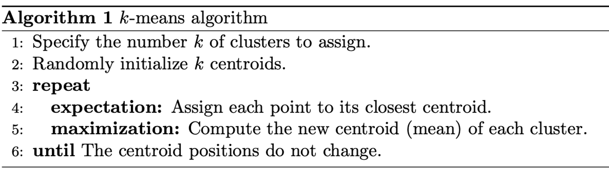 
*https://realpython.com/k-means-clustering-python/*

**Hyperparameters**

- *k* : The number of clusters to create (Positive integer)
- *distanceMeasure* : Calculation of the distance measure (Euclidean or Cosine)
- *maxIter* : The maximum number of iterations (Positive integer)
- *tol* : The convergence tolerance for iterative algorithms (Positive integer)

###### The beginning - `clusteringScore0`

For this first grouping, we ignore non-numerical features and try to place each data point near its nearest centroid with Euclidean distance. To do this, *KMeansModel* provides us with the `computeCost()` method which can be used to compute the mean squared distance.

As a first test, we chose to make the value of k evolve between 20 and 300 with jumps of 10 (i.e. we tested the clustering with k=20, then k=30, k=40, etc).

| *k from 20 to 300, jumps of 10*<br>  |
|:---:|

With these parameters, we can see that a good value for k seems to be between 200 and 280. We decide to run the process again with k evolving between 200 and 280 with jumps of 5. As we can fall into a local minimum, we decide to run the tests twice.

| *k from 200 to 280, jumps of 5*<br>  |
|:---:|

As we see again, the score decreases as k increases and the best score value for k is two times when k = 280. This makes sense because the more clusters you add, the closer the data points can be to a centroid. To be sure, we decide to restart the training by increasing the range to 320.

| *k from 200 to 320, jumps of 5*<br>  |
|:---:|

Not surprisingly, the best score is now obtained with k = 320. In view of the results, this method will not be sufficient to determine the best value of k. It is therefore necessary to make some improvements.

###### Max iteration and tolerance - `clusteringScore1`

To improve the classification, we can run the iteration for a longer time via the `setTol()` method. This method controls the minimum significant amount of centroid movement. It is also possible to increase the maximum number of iterations with the `setMaxIter()` method which will prevent the algorithm from stopping too soon.

Here again, we chose to make the value of k evolve between 20 and 300 with jumps of 10 to see first results. We increase the max iteration from default value 20 to 40 and decrease the tolerance value from default 1.0e-4 to 1.0e-5.

The aim is to find the "elbow" in the graph beyond which the increase in k stops reducing the score significantly.

| *k from 20 to 300, jumps of 10*<br>  |
|:---:|

| *k from 35 to 175, jumps of 5*<br>  |
|:---:|

With this max iteration (40) and tolerance (1.0e-5) values, the elbow seems to be around 120.

| *k from 200 to 280, jumps of 5*<br>  |
|:---:|

If we try with largers k-values, we see a kind of anarchy and no "elbow" at all!

###### Normalization - `clusteringScore2`

To further improve our results and find the right value of k we can normalise the different characteristics. MLlib provides the `StandardScale` class which allows you to easily perform these standarisations.

| *k from 20 to 300, jumps of 10*<br>  |
|:---:|

With this normalisation, the elbow seems to be around 160.

| *k from 20 to 200, jumps of 5*<br>  |
|:---:|

If we decrease the jumps, the elbow seems now to be between 120 and 140.

| *k from 220 to 320, jumps of 5*<br>  |
|:---:|

With larger k-values, we do not see any other "elbow" emerging.

###### Non-numeric features - `clusteringScore3`

After this standardisation, it would be nice to add the non-numerical characteristics to improve the clustering. The MLlib library provides a `OneHotEncoder` class allowing easily the implementation of one-hot encoding. Therefore, the clustering will use all available input features.

| *k from 20 to 300, jumps of 10*<br>  |
|:---:|

With this run, we can clearly see an elbow at k = 110, but if we look forward there appears to be another elbow around k = 150.

| *k from 100 to 240, jumps of 5*<br>  |
|:---:|

On these two second tests, we see more precisely the elbow no longer around 110 or 150, but around k = 185.

###### Entropy - `clusteringScore4`

Finally, to achieve good clustering, we would like to have clusters whose label collections are homogeneous and therefore have low entropy. A weighted average of the entropy can therefore be used as a new score to define the optimal value of k. 

To do so, the following 4 steps are applied:

1. Predict the cluster for each data item
2. Extract collections of labels, by cluster
3. Count the labels in the collections
4. Average entropy weighted by cluster size

In this way, it is possible to search for a local minimum value for k because the entropy does not necessarily decrease when k increases.

| *k from 20 to 300, jumps of 10*<br>  |
|:---:|

With this visualisation, there seems to be a first elbow around k = 160 and a second one around k = 230. 

| *k from 140 to 220, jumps of 5*<br>  |
|:---:|

If we run on k between 140 to 220 with jumps of 5, no elbow is clearly visible. As the various improvement steps are now applied, we will now vary k by jumps of 1.

| *k from 160 to 200, jumps of 1*<br> 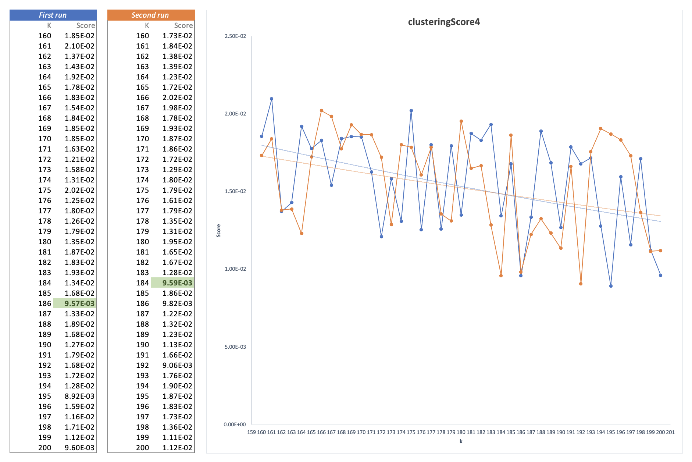 |
|:---:|

After 3 runs, it is clearly visible that the best score results are obtained when the value of k is around 185. Therefore, we will do a final test, around k = 185, by lowering the tolerance value from 1.0e-5 to 1.0e-6 and increasing the maximum iteration number from 40 to 60.

| *k from 175 to 195, jumps of 1*<br> 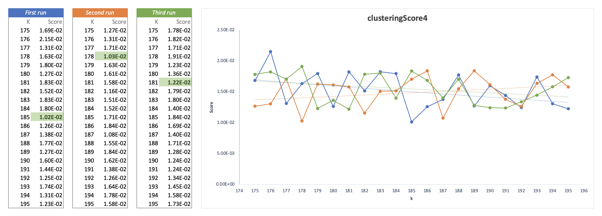 |
|:---:|

If we sum the results of the scores of the 3 runs, and sort these sums in an ascending manner, this is what we get for k values : 192 (3.85E-02), 187 (3.86E-02), 191 (4.06E-02). Finnaly and with our experiences, we can conclude that best value for k seems to be **192** or 187.

###### Clustering - `fitPipeline4`

It is possible with scala to display the clusters that have been defined for a specific k. For each group, we can print the labels to get an idea of the resulting clustering. 

**k = 192**

```scala
+-------+------------+-------+
|cluster|       label|  count|
+-------+------------+-------+
|      0|    neptune.| 359264|
|      0|  portsweep.|    134|
|      1|    ipsweep.|     40|
|      1|       nmap.|      6|
|      1|     normal.|   3384|
|      1|  portsweep.|      2|
|      1|      satan.|      7|
|      1|      smurf.|2807852|
|      2|    neptune.|   1035|
|      2|  portsweep.|      7|
|      2|      satan.|      2|
|      3|  ftp_write.|      1|
|      3|    neptune.|    832|
|      3|  portsweep.|      5|
|      3|      satan.|      3|
|      4|    neptune.|   1035|
|      4|  portsweep.|      9|
|      4|      satan.|      2|
|      5|     normal.|    840|
|      5|warezclient.|      5|
|    ...|.        ...|    ...|
+-------+------------+-------+
```

With k = 192 and this clustering, we can see that:

- Cluster 0 is clearly regrouping neptune attacks.
- Cluster 1 groups the smurf attacks, but some normal connections are also grouped in this.
- Cluster 2, 3 and 4 groups neptune attacks to.

And this continues for the other 188 clusters.

**k = 187**

```scala
+-------+------------+------+
|cluster|       label| count|
+-------+------------+------+
|      0|    neptune.|358926|
|      0|  portsweep.|    99|
|      1|     normal.| 68058|
|      2|     normal.|    86|
|      2|      smurf.|163509|
|      3|    neptune.|   837|
|      3|  portsweep.|    11|
|      3|      satan.|     3|
|      4|     normal.|  3833|
|      5|    ipsweep.|   819|
|      5|       nmap.|    36|
|      5|     normal.|  3693|
|      5|  portsweep.|     2|
|      5|      satan.|    23|
|      6|      satan.|     2|
|      7|    neptune.|   200|
|      7|  portsweep.|    10|
|      7|      satan.|     3|
|      8|     normal.|   538|
|      8|warezclient.|   274|
|    ...|         ...|   ...|
+-------+------------+------+
```

With k = 187 and this clustering, we can see that:

- Cluster 0 is always regrouping neptune attacks.
- Cluster 1 groups only normal connections.
- Cluster 2 groups the smurf attacks, but a little of normal connections are also grouped in this.
- Cluster 3 groups neptune attacks to.
- ...

This clustering seems to do some smaller clusters. In order to identify whether its grouping is more suitable than the previous one, it would be necessary to analyse all the clusters created.

**k = 191**

```scala
+-------+----------+-------+
|cluster|     label|  count|
+-------+----------+-------+
|      0|  neptune.| 456269|
|      1|  neptune.|     46|
|      1|   normal.|  26429|
|      2|  ipsweep.|     13|
|      2|  neptune.|   1037|
|      2|portsweep.|     12|
|      2|    satan.|      3|
|      3|  ipsweep.|     40|
|      3|     nmap.|      6|
|      3|   normal.|   3382|
|      3|portsweep.|      2|
|      3|    satan.|      7|
|      3|    smurf.|2807853|
|      4|  ipsweep.|     13|
|      4|  neptune.|   1046|
|      4|   normal.|     38|
|      4|portsweep.|     11|
|      4|    satan.|      3|
|      5|portsweep.|      2|
|      5|    satan.|  10627|
|    ...|       ...|    ...|
+-------+----------+-------+
```

With k = 191 and this clustering, we can see that:

- Interesting, Cluster 0 groups only neptune attakcs, and a lot of it!
- Cluster 1 groups normal connections but with some neptune attakcs, which may be problematic.
- Cluster 2 groups other neptune attakcs.
- Cluster 3 groups smurf attacks but again with some normal connections which may be problematic.

##### Improvements and optimisations

###### Cosine distance measure - `clusteringScore5`

As we have seen, the K-means algorithm requires a notion of distance between data points. So far, we have used the simple Euclidean distance to measure the distance between data points. There is another distance function supported by Spark MLlib: The Cosine distance measure.
 
Cosine similarity is a measure of similarity between two non-zero vectors in an inner product space that measures the cosine of the angle between them. **It is therefore a judgment on orientation and not on magnitude**. Two vectors with the same orientation have a cosine similarity of 1, two vectors oriented at 90° to each other have a similarity of 0, and two diametrically opposed vectors have a similarity of -1; and this independent of their magnitude.

| *k from 20 to 300, jumps of 10*<br>  |
|:---:|

With the *cosine similarity*, we can guess an elbow around k = 200. We are therefore in the same values of k as discover before with the euclidean distance.

| *k from 140 to 220, jumps of 5*<br> 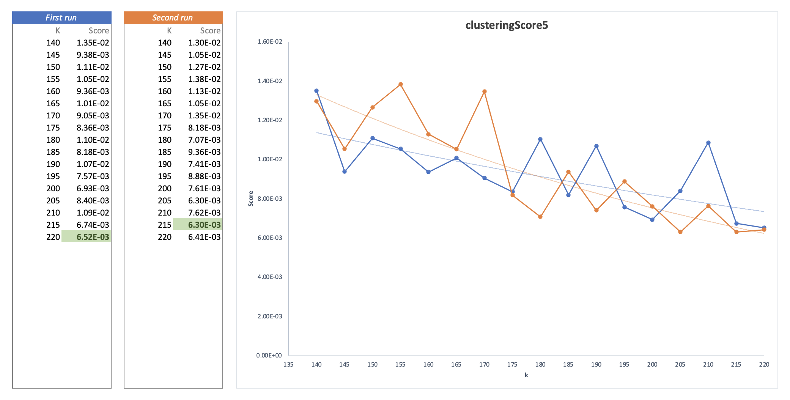 |
|:---:|

If k is varied from 140 to 220 with jumps of 5, the score obtained by cosine similarity decreases as k increases. There are no clear "elbow" in the graph.

| *k from 160 to 200, jumps of 1*<br> 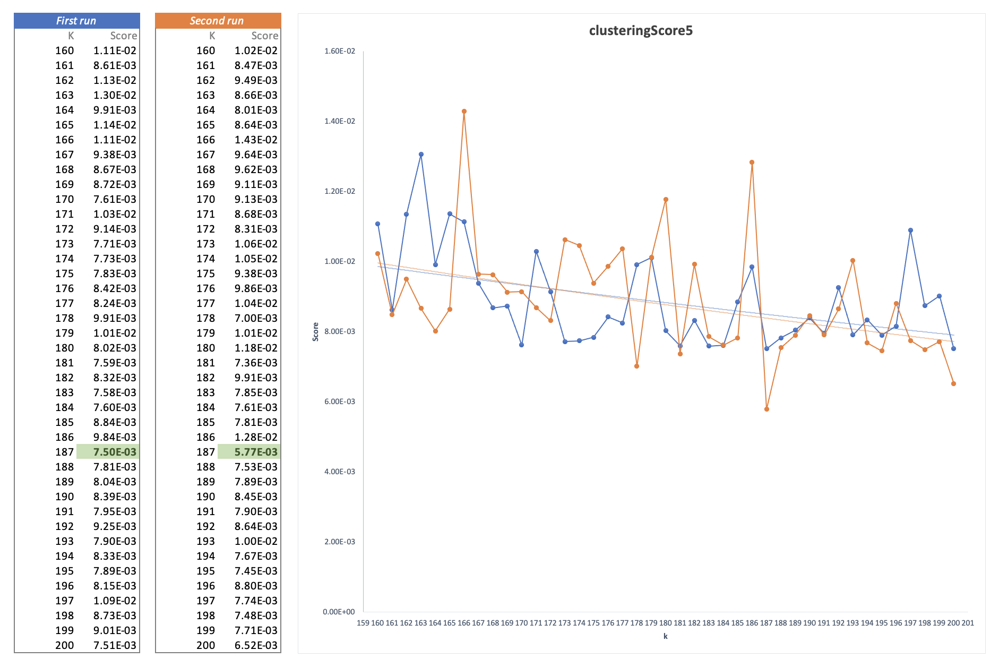 |
|:---:|

With this evaluation of the distance by the cosine and after 3 runs, the best score is obtained third times with **k = 187**.

###### Silhouette coefficient - `clusteringScore6`

Another measure attempting to assess not only the proximity of points within a cluster, but also the proximity of points to other clusters can be implemented. The *Silhouette coefficient* is one such measure, and we have carried out tests with it.

Unfortunately, after many tests, we were not able to train our model and evaluate it with the *"Silhouette coefficient"*. This could be done in an improvement section to confirm or refute the results already found with the Euclidean distance.

###### Bisecting K-means - `clusteringScore7`

The "Bisecting K-means" algorithm is a type of hierarchical clustering using a top-down split approach. All observations start in a cluster, and splits are performed recursively as one moves down the hierarchy. Bisecting K-means will generally produce a different clustering.

We ran the "Bisecting K-means" algorithm with the same parameters as those used in *clusteringScore4*, including entropy and optimisations.

| *k from 20 to 300, jumps of 10*<br> 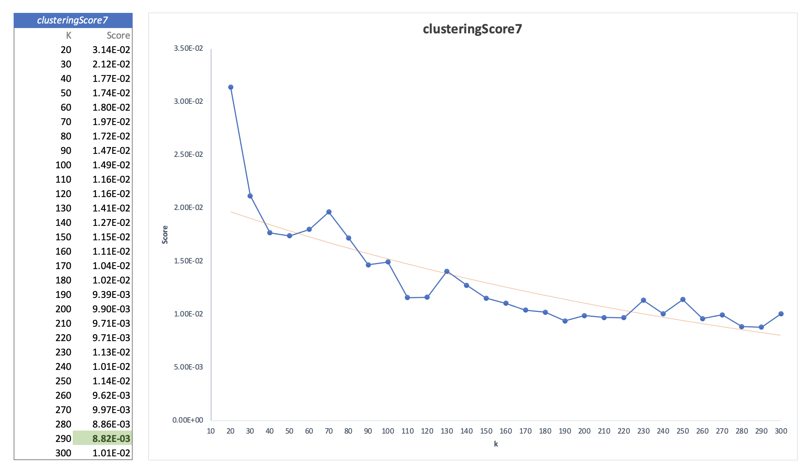 |
|:---:|

As these trainings are very time consuming, we lack the time to make more accurate runs with this algorithm. However, the conclusions are again the same, an elbow appears at k = 190, so we should continue to test with k values around 190.

| *k from 185 to 195, jumps of 1*<br> 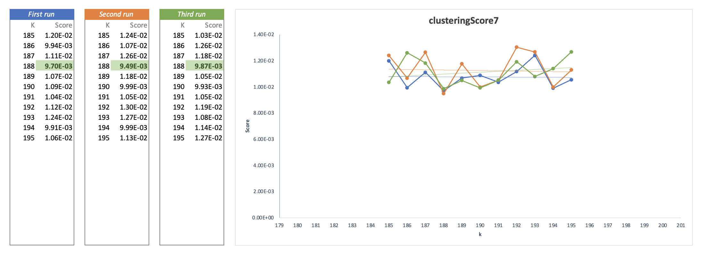 |
|:---:|

If we try a (quick) run around k = 190, we obtain the best score values three times for **k = 188**. Again, it would be good to do more tests with larger ranges of values.

#### Testing, evaluation and results

After all these different steps and improvements, we can combine some results and draw some conclusions. We have grouped in a table all the steps with a estimated best range for k value and an "ideal" value.

| Step | Estimated range value | Best *k* value |
|:-----|:-------------:|:-------------:|
| The beginning - `clusteringScore0` | k >= 320 | - |
| Max iteration and tolerance - `clusteringScore1` | 220 <= k <= 230 | - |
| Normalization - `clusteringScore2` | 120 <= k <= 140 | - |
| Non-numeric features - `clusteringScore3` | around k = 185 | - |
| **Entropy - `clusteringScore4`** | around k = 185 | **k = 192** |
| **Cosine distance measure - `clusteringScore5`** | 170 <= k <= 200 | **k = 187** |
| **Bisecting K-means - `clusteringScore7`** | around k = 190 | **k = 188** |

But finally, the correct choice of the k parameter is determined by the purpose of the application. And for this, we run each clustering one last time with the best founded k-value. This gives us the clusters with their labels and the number of samples classified in each of them that we can graph.

**Entropy (clusteringScore4)** | k = 192, maxIter = 60, tolerance = 1.0e-5

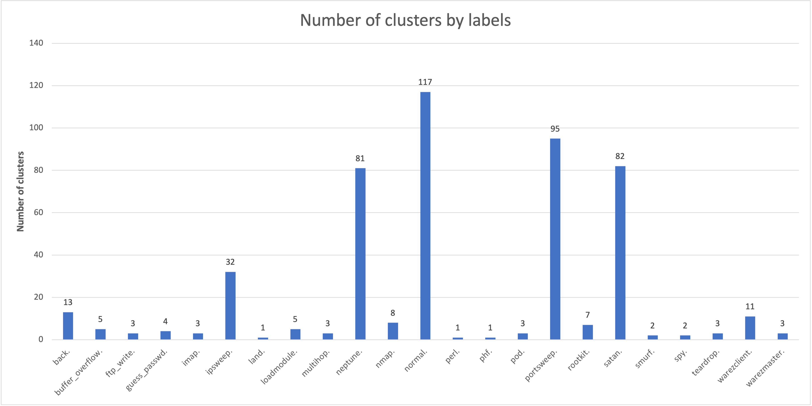

As we can see, the number of clusters per label varies a lot (from 1 to 117). The normal connections are distribuate over 117 clusters, which is not necessarily a good thing.

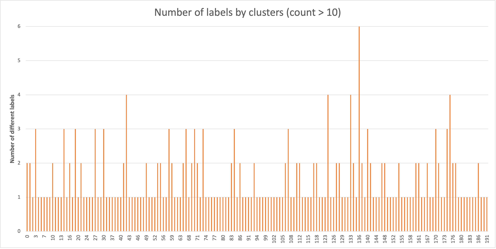

If we look at number of labels by clusters where count are 10 connections, the 192 clusters contains between 1 and 6 labels. This is good but could be further reduced, the aim being to obtain at best 1 label per cluster.

**Cosine distance measure (clusteringScore5)** | k = 187, maxIter = 60, tolerance = 1.0e-5

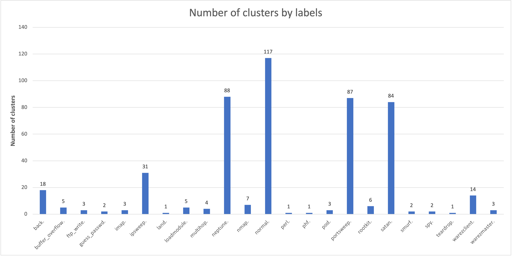

Here again, the number of clusters per label varies from 1 to 117. There are no significant differences with the previous clustering.

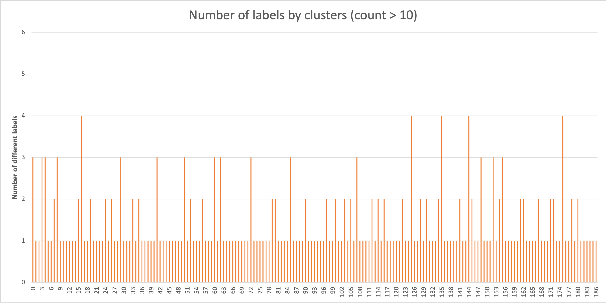

On the other hand, when you look at number of labels by clusters where count are 10 connections, the max number of labels per label decrease to 4 which is a good thing.

**Bisecting K-means (clusteringScore7)** | k = 188, maxIter = 60, tolerance = 1.0e-5

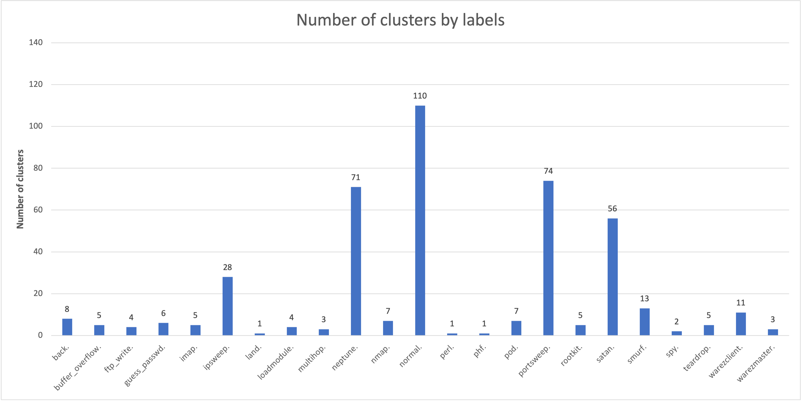

With *Bisecting K-means*, the maximum number of clusters by labels decrease from 117 to 110, its a good news.

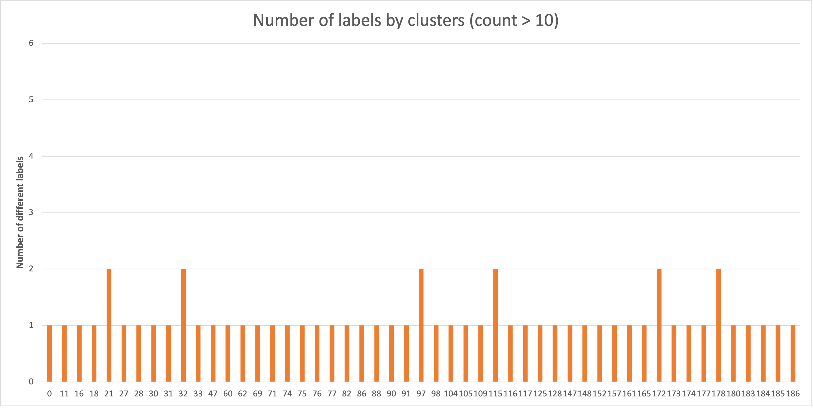

If we look at number of labels by clusters where count are 10 connections, there are no more than 2 labels by clusters. This clustering thus seems much better than the two previous ones.

**Combined results**

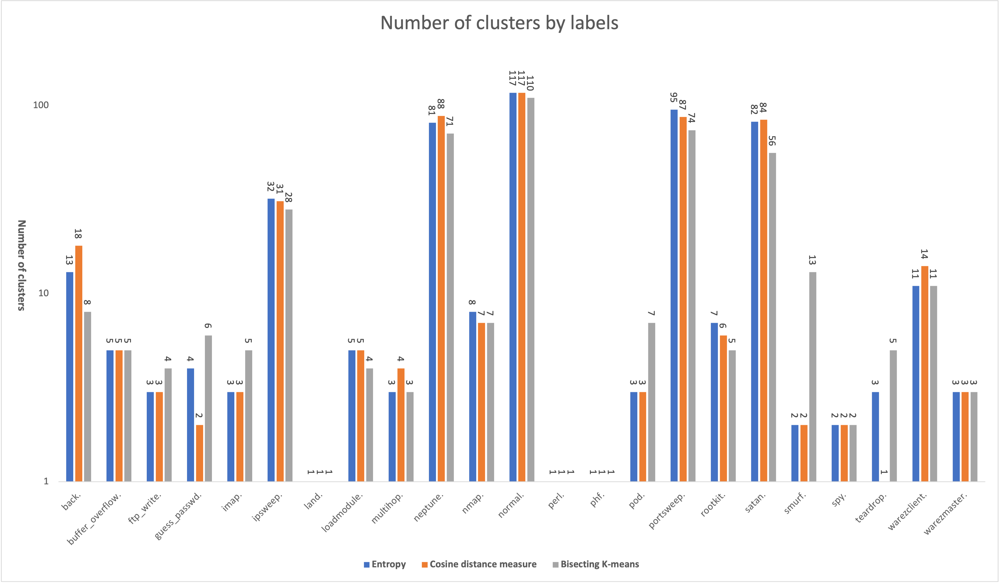

### 3.3 What is the distribution of attacks on each protocol (*TCP, UDP, ICMP*...), by which service (port) were they carried out, what type of attacks are they and what was the final purpose of the attack ?

First, we need to discover and visualize which protocol is mainly used for the attacks. To do that, we write a scala function and plot the results into a pie chart.

```scala
// Determine the distribution of request by each protocol
data.select("protocol_type", "label")
  .where("label != 'normal'")
  .groupBy("protocol_type").count().orderBy($"count".desc)
  .withColumn("percentage", round(($"count" / data.count()) * 100, 2))
  .show(100)
```

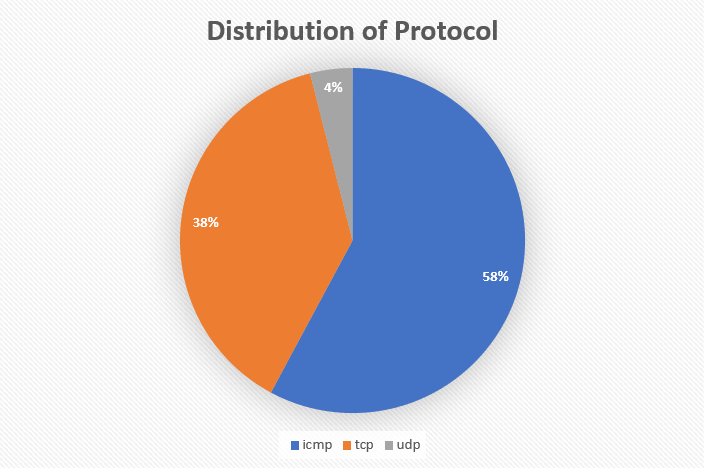

We clearly see that the most used protocol is *IMCP*, followed by *TCP* and then *UDP*, at a much lower rate. This can easily be explained if we look into details which protocol have which attack.

For each protocols (*TCP, UDP and ICMP*), we can also see what attack type was the most present.Again, we write a scala function to do this and plot the results.

**IMCP**

| *ICMP request Distribution*<br> 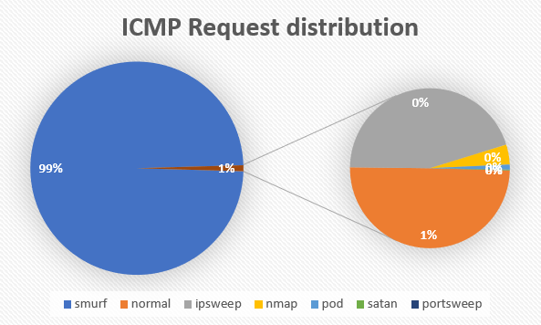 |
|:---:|

We can see that this protocol is dominated by the "smurf" anomaly, a DoS type attack. If we remove this attack, we still have about 50% of the rest as normal requests. We also see some Probing attack, such as ipsweep and other less frequent anomalies

**TCP**

| *TCP request Distribution*<br> 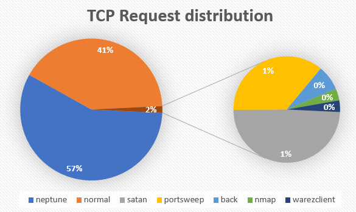 |
|:---:|

We have 2 main request type for this protocol :

- DoS attack "neptune", with 57% of TCP requests
- Normal requests

If we look at the less frequent requests, we see some probing, with *portsweep*, and some *R2L* attacks with *warezclient*. This protocol also have the most unique attack types of all, with 20 different request labels.

**UDP**

| *UDP request Distribution*<br> 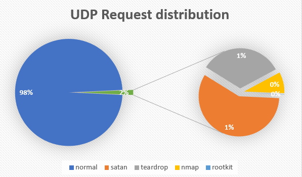 |
|:---:|

This protocol is mainly used for normal attacks, but we can also see some probing and *I2R* attacks. UDP is less used for *DoS* attacks, which is the reason why there are less requests using it.

##### Analysis

Hereafter are the raw number of request for each protocol.

```scala
--- attackDistribution TCP ---      --- attackDistribution UDP ---
  +----------------+-------+		       +---------+------+
  |           label|  count|		       |    label| count|
  +----------------+-------+		       +---------+------+
  |        neptune.|1072017|		       |  normal.|191348|
  |         normal.| 768670|		       |   satan.|  1708|
  |          satan.|  14147|		       |teardrop.|   979|
  |      portsweep.|  10407|		       |    nmap.|   250|
  |           back.|   2203|		       | rootkit.|     3|
  |           nmap.|   1034|		       +---------+------+
  |    warezclient.|   1020|
  |        ipsweep.|    924|	       --- attackDistribution ICMP ---
  |   guess_passwd.|     53|		       +----------+-------+
  |buffer_overflow.|     30|		       |     label|  count|
  |           land.|     21|		       +----------+-------+
  |    warezmaster.|     20|		       |    smurf.|2807886|
  |           imap.|     12|		       |   normal.|  12763|
  |     loadmodule.|      9|		       |  ipsweep.|  11557|
  |      ftp_write.|      8|		       |     nmap.|   1032|
  |       multihop.|      7|		       |      pod.|    264|
  |        rootkit.|      7|		       |    satan.|     37|
  |            phf.|      4|		       |portsweep.|      6|
  |           perl.|      3|		       +----------+-------+
  |            spy.|      2|
  +----------------+-------+
```

We can see that some labels only appear in one protocol, such as neptune, smurf or perl, while others appear in multiple protocol, such as rootkit, portsweep or nmap.

The normal requests use a lot more the TCP and UDP protocol, which are the 2 less used overall, due to the overflowing of the "smurf" and "neptune" DoS attacks.

Both R2L and I2R are much less represented in term of quantity, independent on which protocol is used.

### 4. Possible future enhancements

To improve clustering and obtain even better results on the classification of these anomalies, various other models could be applied instead of simple *K-means clustering*. For example, a *Gaussian mixture model* or *DBSCAN* could capture more subtle relationships between data points and cluster centres, a neural network with different hidden layers, etc. 

It would also be useful to test the use of distance functions that can better account for distributions and correlations between features, such as the *Mahalanobis distance*.

## Conclusion

At the beginning, it was hard to get into this project, as we encountered several environmental problems, especially in running the scala application. In addition, the training sessions are extremely long, which makes the tests tedious, but which also forces you to be precise.

This project was very enriching for us and allowed us to discover more in depth *scala*, *spark* and the *k-means* algorithm. The fact that we were able to start from an existing application was a good thing, and the questions to be developed allowed us to understand the subject well. We would have liked to have had more time, in particular to tackle the visualisation part of the project in R, which we deliberately left aside for lack of knowledge. We are happy with the results we have achieved and the learning we have done.

## Sources

- [Chapter 5 (Anomaly Detection in Network Trafc with K-means Clustering) of Advanced Analytics with Spark by Sean Owen](Documentation/Anomaly-Detection-in-Network-Traffic-with-K-means-Clustering.pdf)
- [kdd.ics.uci.edu/databases/kddcup99/kddcup99.html](http://kdd.ics.uci.edu/databases/kddcup99/kddcup99.html)
- [kaggle.com/code/abhaymudgal/intrusion-detection-system](https://www.kaggle.com/code/abhaymudgal/intrusion-detection-system)
- [spark.apache.org/docs/latest/ml-clustering.html#k-means](https://spark.apache.org/docs/latest/ml-clustering.html#k-means)
- [spark.apache.org/docs/latest/api/scala/org/apache/spark/ml/clustering/KMeans.html](https://spark.apache.org/docs/latest/api/scala/org/apache/spark/ml/clustering/KMeans.html)

## Annexes

- Source code: [RunKMeans.scala](/anomaly-kmeans/src/main/scala/com/cloudera/datascience/kmeans/RunKMeans.scala)
- Highlighted changes in scala file: [commit 4b324979c3ca63ea9e838790a4384e0743079c6b](https://github.com/weevood/MA-BDA_Project/commit/4b324979c3ca63ea9e838790a4384e0743079c6b?diff=split)
- Data: [kddcup.data.gz](http://kdd.ics.uci.edu/databases/kddcup99/kddcup.data.gz)
- Slides of the presentation: [Anomaly-Detection-in-Network-Traffic-with-K-means-Clustering.pptx](/Documentation/Anomaly-Detection-in-Network-Traffic-with-K-means-Clustering.pptx)
- Plots of question 2: [Qb-Plots.xlsx](/Documentation/Qb-Plots.xlsx) and results: [Qb-Results.xlsx](/Documentation/Qb-Results.xlsx)
