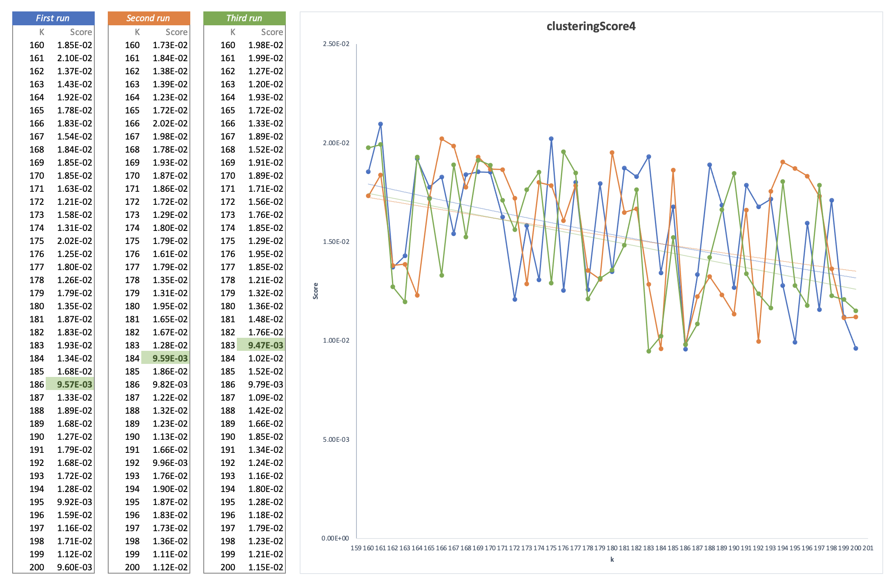
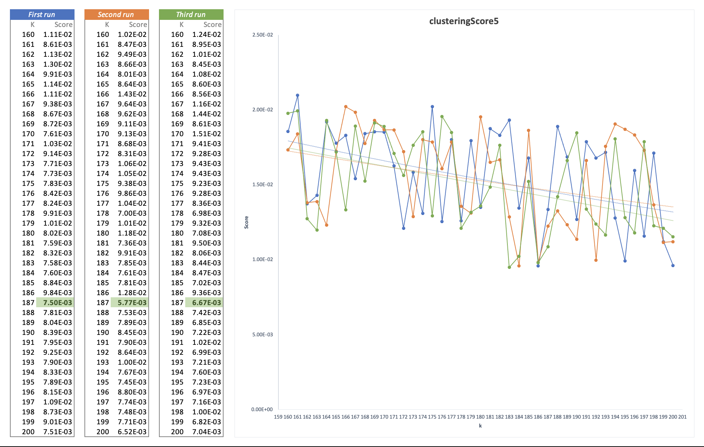

# MA-BDA - Anomaly Detection in Network Traffic with K-means Clustering

###### Alt Thibaud, Bueche Lucas | Deadline on Friday 10.06.2022 | [github.com/weevood/MA-BDA_Project](https://github.com/weevood/MA-BDA_Project)

## Summary

The goal is to **detect anomalous behavior in the network traffic of an organization**. Anomalous behavior can point to things like intrusion attempts, denial-of-service attacks, port scanning, etc.

The dataset was generated for a data analysis competition from raw TCP dump data for a local-area network (LAN) simulating a typical U.S. Air Force LAN. The LAN was operated as if it were a true Air Force environment, but peppered with multiple attacks. Feature extraction was already run on the data, the dataset contains a list of connections, and for each connection 38 features, like the number of bytes sent, login attempts, TCP errors, and so on.

As the data is not labeled, an unsupervised learning algorithm is applied, more specifically *K-means clustering*. The idea is to let the clustering discover normal behavior. Connections that fall outside of clusters are potentially anomalous.

## Documentation

### 1. Description of the dataset (size, information it contains)

The KDD Cup dataset comes from Lincoln Laboratories, who set up an environment to simulating a typical US Air Force LAN and acquire nine weeks of raw TCP dump data. The Laboratories operated the LAN as if it were a real Air Force environment, but subjected it to multiple attacks.

This dataset is very large, containing approximately 743 MB of data and about **5 million individual network connections**. A connection is a sequence of TCP packets starting and ending at defined times, between which data flows to and from a source IP address to a target IP address, according to a well-defined protocol.  Each connection is labelled either as normal or as an attack, with exactly one specific type of attack. 

Each connection is a row in a CSV file as follows: 

```csv
0,tcp,http,SF,215,45076,0,0,0,0,0,1,0,0,0,0,0,0,0,0,0,0,1,1,0.00,0.00,0.00,0.00,1.00,0.00,0.00,0,0,0.00,0.00,0.00,0.00,0.00,0.00,0.00,0.00,normal.
```

#### Network connection characteristics

For each network connection, the data set contains the **42** following characteristics: 

| # | Feature | Data type | Example |
|:-:|:--------|:----------|:--------|
| 1 | duration | continuous | 0 |
| 2 | protocol\_type | symbolic | tcp |
| 3 | service | symbolic | http |
| 4 | flag | symbolic | SF |
| 5 | src\_bytes | continuous | 215 |
| 6 | dst\_bytes | continuous | 45076 |
| 7 | land | symbolic | 0 |
| 8 | wrong\_fragment | continuous | 0 |
| 9 | urgent | continuous | 0 |
| 10 | hot | continuous | 0 |
| 11 | num\_failed\_logins | continuous | 0 |
| 12 | logged\_in | symbolic | 1 |
| 13 | num\_compromised | continuous | 0 |
| 14 | root\_shell | continuous | 0 |
| 15 | su\_attempted | continuous | 0 |
| 16 | num\_root | continuous | 0 |
| 17 | num\_file\_creations | continuous | 0 |
| 18 | num\_shells | continuous | 0 |
| 19 | num\_access\_files | continuous | 0 |
| 20 | num\_outbound\_cmds | continuous | 0 |
| 21 | is\_host\_login | symbolic | 0 |
| 22 | is\_guest\_login | symbolic | 0 |
| 23 | count | continuous | 1 |
| 24 | srv\_count | continuous | 1 |
| 25 | serror\_rate | continuous | 0.00 |
| 26 | srv\_serror\_rate | continuous | 0.00 |
| 27 | rerror\_rate | continuous | 0.00 |
| 28 | srv\_rerror\_rate | continuous | 0.00 |
| 29 | same\_srv\_rate | continuous | 1.00 |
| 30 | diff\_srv\_rate | continuous | 0.00 |
| 31 | srv\_diff\_host\_rate | continuous | 0.00 |
| 32 | dst\_host\_count | continuous | 0 |
| 33 | dst\_host\_srv\_count | continuous | 0 |
| 34 | dst\_host\_same\_srv\_rate | continuous | 0.00 |
| 35 | dst\_host\_diff\_srv\_rate | continuous | 0.00 |
| 36 | dst\_host\_same\_src\_port\_rate | continuous | 0.00 |
| 37 | dst\_host\_srv\_diff\_host\_rate | continuous | 0.00 |
| 38 | dst\_host\_serror\_rate | continuous | 0.00 |
| 39 | dst\_host\_srv\_serror\_rate | continuous | 0.00 |
| 40 | dst\_host\_rerror\_rate | continuous | 0.00 |
| 41 | dst\_host\_srv\_rerror\_rate | continuous | 0.00 |
| 42 | label | string | normal |

The label value, given in the last field, can be one of the following (23 possibilities) : *back, buffer\_overflow, ftp_write, guess_passwd, imap, ipsweep, land, loadmodule, multihop, neptune, nmap, normal, perl, phf, pod, portsweep, rootkit, satan, smurf, spy, teardrop, warezclient, warezmaster*. In the dataset, most connections are labeled *normal*.

#### Attacks main categories

The various attacks can be divided into four main categories:

1. **DOS**: Denial-of-service attack, like *SYN flood*
2. **R2L**: Unauthorized access from a remote machine like *guessing password*
3. **U2R**: Unauthorized access to local superuser (root) privileges like *various buffer overflow attacks*
4. **Probing**: Surveillance and other probing like *port scanning*

### 2. Description of the features used and any pre-processing to extract additional features

On this dataset, the features extraction was already done for us. We know that there are already 38 numeric features that we can exploit.

#### Labels distribution 

First, we want to know the distribution of labels on the data and how many data there are for each label. To do this with *Spark*, you simply group the data by "label", order them and display them. In addition, we calculate the percentage distribution of each label on the dataset.

```spark
data.select("label").groupBy("label").count().orderBy($"count".desc)
	 .withColumn("percentage", round(($"count" / data.count()) * 100, 2))
	 .show(100)

+----------------+-------+----------+
|           label|  count|percentage|
+----------------+-------+----------+
|          smurf.|2807886|     57.32|
|        neptune.|1072017|     21.88|
|         normal.| 972781|     19.86|
|          satan.|  15892|      0.32|
|        ipsweep.|  12481|      0.25|
|      portsweep.|  10413|      0.21|
|           nmap.|   2316|      0.05|
|           back.|   2203|      0.04|
|    warezclient.|   1020|      0.02|
|       teardrop.|    979|      0.02|
|            pod.|    264|      0.01|
|   guess_passwd.|     53|       0.0|
|buffer_overflow.|     30|       0.0|
|           land.|     21|       0.0|
|    warezmaster.|     20|       0.0|
|           imap.|     12|       0.0|
|        rootkit.|     10|       0.0|
|     loadmodule.|      9|       0.0|
|      ftp_write.|      8|       0.0|
|       multihop.|      7|       0.0|
|            phf.|      4|       0.0|
|           perl.|      3|       0.0|
|            spy.|      2|       0.0|
+----------------+-------+----------+
```

We can indeed confirm that there are 23 possible labels. The most frequent labels on our data, by far, are : _smurf (~57%)_ and _neptune (~22%)_. Interestingly, the connections identified as *normal*, which are not anomalies, represent just under 20% of our dataset. All other labels are very poorly represented (less than 1%).

#### Non-numeric features

We have three columns (in addition to the labels) that contains non-numeric values : *protocol_type*, *service*, and *flag*. In the initial stages, these features will not be explored. These non-numeric features can be represented using "one- hot encoding", which can then be considered as numeric dimensions.

**Example for the *protocol_type* column**

As there is three possible values for this column (*TCP*, *UDP* or *ICMP*), these three dimension can be represent by one value (x, x, x). Of these three values only one can be set to 
1, the other values are set to 0. 

We can see as a table of *protocol_type* with only one enable dimension. Example for *UDP* :

| TCP | UDP | ICMP |
|:---:|:---:|:----:|
|  0  |  1  |  0   |

If we want to represent the *TCP* value of the characteristic, we encode: 1,0,0. If you want to represent the *UDP* value of the characteristic, you will encode: 0,1,0. And if you want to represent the *ICMP* value of the characteristic, you should encode: 0,0,1.

This one-hot encoding transformation can also be used for the features *service*, and *flag*.

### 3. Questions for which you hope to get an answer from the analysis

After brainstorming and validation, we have decided to develop the following analytical questions and answer them using *Spark*.

 - **What are the characteristics and features that define an anomaly ?**
 - **How to find the optimal value of the hyperparameter K of the K-means clustering ?**
 - **What is the distribution of attacks on each protocol (*TCP, UDP, ICMP*...), by which service (port) were they carried out, what type of attacks are they and what was the final purpose of the attack ?**

###### Analytical question ideas

- _What defines an anomaly ?_
- _Why use an unsupervised algorithm such as K-Means ?_
- _How to find the correct K ?_
- _Which types of anomaly can we detect on a network ?_
- _Which patterns are often used by attackers to exploit flaws ?_
- _What is the distribution of attacks on each protocol (TCP, UDP, ICMP...) ?_
	- _By which service (port) were they carried out ?_
	- _What type of attacks are they?_
	- _What was the final purpose of the attack ?_
	- _..._

### 4. Algorithms you applied

### 5. Optimisations you performed

### 6. Your approach to testing and evaluation

### 7. Results you obtained

The three analytical questions results, which we had to develop and answer using the Spark, are available below.

#### a) What are the characteristics and features that define an anomaly ?
##### Result
##### Development

#### b) How to find the optimal value of the hyperparameter K of the K-means clustering ?
##### Result
##### Development

For this question, we want to know how many clusters are appropriate for this data set. As there are 23 possible distinct label values for classification, it seems that k must be at least 23. If the value of k chosen is equal to the number of data points, each point will be its own cluster. The value of k must therefore be between 23 and 4.9 million, this leaves us with a considerable choice of values !

A clustering is considered good if each data point is close to its nearest centroid. The Euclidean distance can be used to define this distance.
KMeansModel provides a *computeCost* method that calculates the sum of the squared distances and can be used to define the score of a cluster.

###### The beginning - `clusteringScore0`

For this first grouping, we ignore non-numerical features and try to place each data point near its nearest centroid with Euclidean distance. To do this, *KMeansModel* provides us with the `computeCost()` method which can be used to compute the mean squared distance.

As a first test, we chose to make the value of k evolve between 20 and 300 with jumps of 10 (i.e. we tested the clustering with k=20, then k=30, k=40, etc).

| *k from 20 to 300, jumps of 10*<br>  |
|:---:|

With these parameters, we can see that a good value for k seems to be between 200 and 280. We decide to run the process again with k evolving between 200 and 280 with jumps of 5. As we can fall into a local minimum, we decide to run the tests twice.

| *k from 200 to 280, jumps of 5*<br>  |
|:---:|

As we see again, the score decreases as k increases and the best score value for k is two times when k = 280. This makes sense because the more clusters you add, the closer the data points can be to a centroid. To be sure, we decide to restart the training by increasing the range to 320.

| *k from 200 to 320, jumps of 5*<br>  |
|:---:|

Not surprisingly, the best score is now obtained with k = 320. In view of the results, this method will not be sufficient to determine the best value of k. It is therefore necessary to make some improvements.

###### Max iteration and tolerance - `clusteringScore1`

To improve the classification, we can run the iteration for a longer time via the `setTol()` method. This method controls the minimum significant amount of centroid movement. It is also possible to increase the maximum number of iterations with the `setMaxIter()` method which will prevent the algorithm from stopping too soon.

Here again, we chose to make the value of k evolve between 20 and 300 with jumps of 10 to see first results. We increase the max iteration from default value 20 to 40 and decrease the tolerance value from default 1.0e-4 to 1.0e-5.

The aim is to find the "elbow" in the graph beyond which the increase in k stops reducing the score significantly.

| *k from 20 to 300, jumps of 10*<br>  |
|:---:|

| *k from 35 to 175, jumps of 5*<br>  |
|:---:|

With this max iteration and tolerance values, the elbow seems to be around 120.

| *k from 200 to 280, jumps of 5*<br>  |
|:---:|

If we try with largers k-values, we see a kind of anarchy and no "elbow" at all!

###### Normalization - `clusteringScore2`

To further improve our results and find the right value of k we can normalise the different characteristics. MLlib provides the `StandardScale` class which allows you to easily perform these standarisations.

| *k from 20 to 300, jumps of 10*<br>  |
|:---:|

With this normalisation, the elbow seems to be around 160.

| *k from 20 to 200, jumps of 5*<br>  |
|:---:|

If we decrease the jumps, the elbow seems now to be between 120 and 140.

| *k from 220 to 320, jumps of 5*<br>  |
|:---:|

With larger k-values, we do not see any other "elbow" emerging.

###### Non-numeric features - `clusteringScore3`

After this standardisation, it would be nice to add the non-numerical characteristics to improve the clustering. The MLlib library provides a `OneHotEncoder` class allowing easily the implementation of one-hot encoding. Therefore, the clustering will use all available input features.

| *k from 20 to 300, jumps of 10*<br>  |
|:---:|

With this run, we can clearly see an elbow at k = 110, but if we look forward there appears to be another elbow around k = 150.

| *k from 100 to 240, jumps of 5*<br>  |
|:---:|

On these two second tests, we see more precisely the elbow no longer around 110 or 150, but around k = 185.

###### Entropy - `clusteringScore4`

Finally, to achieve good clustering, we would like to have clusters whose label collections are homogeneous and therefore have low entropy. A weighted average of the entropy can therefore be **used as a new score** to define the optimal value of k. 

To do so, the following 4 steps are applied:

1. Predict the cluster for each data item
2. Extract collections of labels, by cluster
3. Count the labels in the collections
4. Average entropy weighted by cluster size

In this way, it is possible to search for a local minimum value for k because the entropy does not necessarily decrease when k increases.

| *k from 20 to 300, jumps of 10*<br>  |
|:---:|

With this visualisation, there seems to be a first elbow around k = 160 and a second one around k = 230. 

| *k from 140 to 220, jumps of 5*<br>  |
|:---:|

If we run on k between 140 to 220 with jumps of 5, no elbow is clearly visible. As the various improvement steps are now applied, we will now vary k by jumps of 1.

| *k from 160 to 200, jumps of 1*<br>  |
|:---:|

###### Clustering - `fitPipeline4`

```scala
k = 160
+-------+------------+-------+
|cluster|       label|  count|
+-------+------------+-------+
|      0|      smurf.|2637630|
|      1|    ipsweep.|     13|
|      1|    neptune.|   1042|
|      1|  portsweep.|     13|
|      1|      satan.|      3|
|      2|    neptune.|   1066|
|      2|  portsweep.|      9|
|      2|      satan.|      2|
|      3|       back.|      5|
|      3|     normal.|    153|
|      3|      satan.|      2|
|      3|warezclient.|      1|
|      4|    neptune.|   1038|
|      4|  portsweep.|     13|
|      4|      satan.|      3|
|      5|       back.|    387|
|      5|     normal.| 210288|
|      6|    neptune.|   1030|
|      6|  portsweep.|      6|
|      6|      satan.|      1|
+-------+------------+-------+

k = 161
+-------+----------+------+
|cluster|     label| count|
+-------+----------+------+
|      0|   normal.|192689|
|      1|  ipsweep.|    11|
|      1|  neptune.|    93|
|      1|   normal.| 49982|
|      1|portsweep.|     2|
|      1|    satan.|     6|
|      2|  neptune.|  1043|
|      2|portsweep.|     8|
|      2|    satan.|     3|
|      3|    satan.|     2|
|      4|  ipsweep.|    13|
|      4|  neptune.|  1044|
|      4|portsweep.|    14|
|      4|    satan.|     3|
|      5|  neptune.|  1041|
|      5|portsweep.|    10|
|      5|    satan.|     2|
|      6|    satan.|     2|
|      7|  neptune.|   200|
|      7|portsweep.|     9|
+-------+----------+------+

k = 162
+-------+----------+-------+
|cluster|     label|  count|
+-------+----------+-------+
|      0|  neptune.| 235584|
|      0|portsweep.|     13|
|      1|  ipsweep.|     40|
|      1|     nmap.|      6|
|      1|   normal.|   3384|
|      1|      pod.|      7|
|      1|portsweep.|      2|
|      1|    satan.|      7|
|      1|    smurf.|2807851|
|      2|  neptune.|    842|
|      3|  ipsweep.|     13|
|      3|  neptune.|   1044|
|      3|portsweep.|     14|
|      3|    satan.|      3|
|      4| teardrop.|    259|
|      5|  neptune.|   1039|
|      5|portsweep.|     10|
|      5|    satan.|      2|
|      6|    satan.|      2|
|      7|  neptune.|   1030|
+-------+----------+-------+

k = 163
+-------+----------+-------+
|cluster|     label|  count|
+-------+----------+-------+
|      0|portsweep.|   1564|
|      0|    satan.|  12077|
|      1|  ipsweep.|     40|
|      1|     nmap.|      6|
|      1|   normal.|   3384|
|      1|portsweep.|      2|
|      1|    satan.|      7|
|      1|    smurf.|2807852|
|      2|  neptune.| 365118|
|      2|portsweep.|    120|
|      3|  neptune.|    827|
|      3|portsweep.|      5|
|      3|    satan.|      6|
|      4|  neptune.|   1716|
|      4|   normal.|      5|
|      4|portsweep.|      1|
|      4|    satan.|      4|
|      5|  neptune.|   1040|
|      5|portsweep.|      7|
|      5|    satan.|      2|
+-------+----------+-------+

k = 164
+-------+----------+------+
|cluster|     label| count|
+-------+----------+------+
|      0|     back.|  1211|
|      0|   normal.|202386|
|      0|portsweep.|     1|
|      1|  neptune.|  1011|
|      1|     nmap.|     1|
|      1|portsweep.|     7|
|      1|    satan.|     2|
|      2|  neptune.|  1066|
|      2|portsweep.|     9|
|      2|    satan.|     2|
|      3|   normal.|   348|
|      4|  ipsweep.|    12|
|      4|  neptune.|   840|
|      4|   normal.|   503|
|      4|portsweep.|     6|
|      4|    satan.|     3|
|      5|  ipsweep.|    13|
|      5|  neptune.|  1036|
|      5|portsweep.|    13|
|      5|    satan.|     3|
+-------+----------+------+

k = 165
+-------+----------+-------+
|cluster|     label|  count|
+-------+----------+-------+
|      0|  neptune.| 364667|
|      0|portsweep.|    138|
|      1|  ipsweep.|     40|
|      1|     nmap.|      6|
|      1|   normal.|   3384|
|      1|portsweep.|      2|
|      1|    satan.|      7|
|      1|    smurf.|2807852|
|      2|  neptune.|   1041|
|      2|portsweep.|      9|
|      2|    satan.|      2|
|      3|  neptune.|   1030|
|      3|portsweep.|      6|
|      3|    satan.|      1|
|      4| teardrop.|    970|
|      5|  neptune.|   1043|
|      5|portsweep.|      8|
|      5|    satan.|      6|
|      6|  neptune.|    846|
|      6|   normal.|    910|
+-------+----------+-------+

k = 166
+-------+----------------+------+
|cluster|           label| count|
+-------+----------------+------+
|      0|           back.|   324|
|      0|         normal.| 39296|
|      1|        ipsweep.|  7982|
|      1|           nmap.|     3|
|      1|         normal.|     1|
|      2|        neptune.|821243|
|      2|      portsweep.|   112|
|      3|buffer_overflow.|     6|
|      3|      ftp_write.|     4|
|      3|        ipsweep.|    13|
|      3|     loadmodule.|     1|
|      3|       multihop.|     3|
|      3|        neptune.|  1794|
|      3|         normal.| 36287|
|      3|      portsweep.|     3|
|      3|        rootkit.|     1|
|      3|    warezclient.|   702|
|      3|    warezmaster.|    18|
|      4|        neptune.|  1033|
|      4|      portsweep.|     6|
+-------+----------------+------+

k = 167
+-------+----------+-------+
|cluster|     label|  count|
+-------+----------+-------+
|      0|     back.|      3|
|      0|  neptune.|   1581|
|      0|   normal.|   1200|
|      0|portsweep.|     35|
|      0|    satan.|    146|
|      1|  ipsweep.|     40|
|      1|     nmap.|      6|
|      1|   normal.|   3382|
|      1|      pod.|      5|
|      1|portsweep.|      2|
|      1|    satan.|      7|
|      1|    smurf.|2807852|
|      2|  ipsweep.|     13|
|      2|  neptune.|   1038|
|      2|portsweep.|     14|
|      2|    satan.|      3|
|      3|  neptune.|   1035|
|      3|portsweep.|      7|
|      3|    satan.|      2|
|      4|  neptune.|   1030|
+-------+----------+-------+

k = 168
+-------+----------------+-------+
|cluster|           label|  count|
+-------+----------------+-------+
|      0|buffer_overflow.|      6|
|      0|      ftp_write.|      4|
|      0|        ipsweep.|     13|
|      0|     loadmodule.|      1|
|      0|       multihop.|      3|
|      0|         normal.|  19776|
|      0|        rootkit.|      1|
|      0|    warezclient.|    661|
|      0|    warezmaster.|     18|
|      1|         normal.|     67|
|      1|          smurf.|2807697|
|      2|        neptune.|   4814|
|      2|      portsweep.|    134|
|      2|          satan.|     31|
|      3|        neptune.|    840|
|      3|      portsweep.|     11|
|      3|          satan.|      3|
|      4|        neptune.|   1036|
|      4|      portsweep.|      6|
|      4|          satan.|      1|
+-------+----------------+-------+

k = 169
+-------+----------+-------+
|cluster|     label|  count|
+-------+----------+-------+
|      0|   normal.|  37238|
|      0|    satan.|      8|
|      1|  ipsweep.|     40|
|      1|     nmap.|      6|
|      1|   normal.|   3376|
|      1|portsweep.|      2|
|      1|    satan.|      7|
|      1|    smurf.|2807851|
|      2|  neptune.|   1044|
|      2|portsweep.|      9|
|      2|    satan.|      2|
|      3|  neptune.|   1040|
|      3|portsweep.|      7|
|      3|    satan.|      2|
|      4|  neptune.|   1038|
|      4|portsweep.|     13|
|      4|    satan.|      3|
|      5|  ipsweep.|     13|
|      5|  neptune.|   1046|
|      5|   normal.|     38|
+-------+----------+-------+

k = 170
+-------+----------+-------+
|cluster|     label|  count|
+-------+----------+-------+
|      0|     back.|    387|
|      0|   normal.| 222358|
|      1|  ipsweep.|     40|
|      1|     nmap.|      6|
|      1|   normal.|   3386|
|      1|portsweep.|      2|
|      1|    satan.|      7|
|      1|    smurf.|2807852|
|      2|   normal.|    129|
|      2|    satan.|      6|
|      3|  neptune.|   1040|
|      3|portsweep.|      7|
|      3|    satan.|      2|
|      4|  ipsweep.|     13|
|      4|  neptune.|   1036|
|      4|portsweep.|     13|
|      4|    satan.|      3|
|      5|  neptune.|   1038|
|      5|portsweep.|     13|
|      5|    satan.|      3|
+-------+----------+-------+

k = 171
+-------+----------+-------+
|cluster|     label|  count|
+-------+----------+-------+
|      0|    smurf.|2644225|
|      1|  neptune.|   1035|
|      1|portsweep.|      9|
|      1|    satan.|      2|
|      2|  neptune.|    841|
|      2|portsweep.|      1|
|      3|  ipsweep.|     13|
|      3|  neptune.|   1044|
|      3|portsweep.|     14|
|      3|    satan.|      3|
|      4|     land.|     21|
|      4|   normal.|      7|
|      5|  neptune.|   1038|
|      5|portsweep.|     13|
|      5|    satan.|      3|
|      6|  ipsweep.|     13|
|      6|  neptune.|   1038|
|      6|portsweep.|     14|
|      6|    satan.|      3|
|      7|  neptune.|   1038|
+-------+----------+-------+

k = 172
+-------+----------+-------+
|cluster|     label|  count|
+-------+----------+-------+
|      0|  neptune.| 455728|
|      1|  ipsweep.|     40|
|      1|     nmap.|      6|
|      1|   normal.|   3384|
|      1|portsweep.|      2|
|      1|    satan.|      6|
|      1|    smurf.|2807855|
|      2|  neptune.|    832|
|      2|portsweep.|      5|
|      2|    satan.|      3|
|      3|  ipsweep.|     13|
|      3|  neptune.|   1041|
|      3|portsweep.|     13|
|      3|    satan.|      3|
|      4|  neptune.|   1036|
|      4|portsweep.|      6|
|      4|    satan.|      1|
|      5|  neptune.|   1037|
|      5|portsweep.|     13|
|      5|    satan.|      3|
+-------+----------+-------+

k = 173
+-------+----------+-------+
|cluster|     label|  count|
+-------+----------+-------+
|      0|  neptune.| 354121|
|      0|portsweep.|      8|
|      1|  neptune.|      4|
|      1|   normal.|  22365|
|      2|     back.|     13|
|      2|   normal.|  53327|
|      3|  ipsweep.|     13|
|      3|  neptune.|   1044|
|      3|portsweep.|     14|
|      3|    satan.|      3|
|      4|   normal.|  30799|
|      5|    smurf.|2680930|
|      6|  ipsweep.|      2|
|      6|  neptune.|   1800|
|      6|   normal.|    479|
|      6|portsweep.|      9|
|      6|    satan.|      2|
|      7|  neptune.|    200|
|      7|portsweep.|     12|
|      7|    satan.|      3|
+-------+----------+-------+

k = 174
+-------+----------+-----+
|cluster|     label|count|
+-------+----------+-----+
|      0|     back.|    3|
|      0|   normal.|62334|
|      1|     imap.|    4|
|      1|     nmap.| 1033|
|      1|   normal.|    2|
|      2|  neptune.| 1043|
|      2|portsweep.|    8|
|      2|    satan.|    6|
|      3|   normal.|    9|
|      4|  neptune.| 1030|
|      4|portsweep.|    7|
|      4|    satan.|    2|
|      5|  ipsweep.|   13|
|      5|  neptune.| 1042|
|      5|portsweep.|   13|
|      5|    satan.|    3|
|      6|  neptune.| 1033|
|      6|portsweep.|    6|
|      6|    satan.|    1|
|      7|  neptune.|  200|
+-------+----------+-----+

k = 175
+-------+----------+-------+
|cluster|     label|  count|
+-------+----------+-------+
|      0|  neptune.| 456476|
|      1|  ipsweep.|     40|
|      1|     nmap.|      6|
|      1|   normal.|   3380|
|      1|portsweep.|      2|
|      1|    satan.|      7|
|      1|    smurf.|2807852|
|      2|  neptune.|    843|
|      2|portsweep.|      5|
|      2|    satan.|      3|
|      3|     imap.|      7|
|      3|  neptune.|   1043|
|      3|   normal.|      3|
|      3|portsweep.|      8|
|      3|    satan.|      2|
|      4|   normal.|      1|
|      5|  neptune.|   1037|
|      5|portsweep.|      9|
|      5|    satan.|      3|
|      6|  ipsweep.|     13|
+-------+----------+-------+

k = 176
+-------+----------+------+
|cluster|     label| count|
+-------+----------+------+
|      0|  ipsweep.|    40|
|      0|     nmap.|     6|
|      0|   normal.|  3434|
|      0|      pod.|    87|
|      0|portsweep.|     2|
|      0|    satan.|    11|
|      0|    smurf.|126956|
|      1|   normal.|   148|
|      2|  neptune.|   837|
|      2|portsweep.|    11|
|      2|    satan.|     3|
|      3|  neptune.|  1042|
|      3|portsweep.|    14|
|      3|    satan.|     3|
|      4|  neptune.|  1030|
|      4|portsweep.|     7|
|      4|    satan.|     2|
|      5|  neptune.|   837|
|      5|portsweep.|     2|
|      6|   normal.|     1|
+-------+----------+------+

k = 177
+-------+----------+-------+
|cluster|     label|  count|
+-------+----------+-------+
|      0|  neptune.|   6261|
|      0|portsweep.|    134|
|      1|  ipsweep.|     40|
|      1|     nmap.|      6|
|      1|   normal.|   3382|
|      1|portsweep.|      2|
|      1|    satan.|      7|
|      1|    smurf.|2807853|
|      2|  ipsweep.|     12|
|      2|  neptune.|    840|
|      2|   normal.|    503|
|      2|portsweep.|      6|
|      2|    satan.|      3|
|      3|  neptune.|    834|
|      3|portsweep.|      5|
|      3|    satan.|      2|
|      4|ftp_write.|      2|
|      4|  neptune.|    832|
|      4|portsweep.|      5|
|      4|    satan.|      3|
+-------+----------+-------+

k = 178
+-------+----------+-------+
|cluster|     label|  count|
+-------+----------+-------+
|      0|  neptune.| 365120|
|      0|portsweep.|    111|
|      1|   normal.|     51|
|      1|    smurf.|2807614|
|      2|  neptune.|   1030|
|      2|portsweep.|      6|
|      2|    satan.|      1|
|      3|   normal.|     13|
|      3|portsweep.|     44|
|      4|  ipsweep.|     13|
|      4|  neptune.|   1040|
|      4|   normal.|    504|
|      4|portsweep.|     10|
|      4|    satan.|      3|
|      5|  neptune.|   1041|
|      5|portsweep.|      9|
|      5|    satan.|      2|
|      6|   normal.|      7|
|      6|      pod.|      5|
|      7|  ipsweep.|     13|
+-------+----------+-------+

k = 179
+-------+------------+-------+
|cluster|       label|  count|
+-------+------------+-------+
|      0|    neptune.| 456163|
|      1|      smurf.|2680968|
|      2|    neptune.|   1038|
|      2|  portsweep.|      9|
|      2|      satan.|      3|
|      3|    neptune.|   1036|
|      3|  portsweep.|      6|
|      3|      satan.|      1|
|      4|     normal.|    558|
|      4|warezclient.|     14|
|      5|    neptune.|   1038|
|      5|  portsweep.|     13|
|      5|      satan.|      3|
|      6|  portsweep.|      2|
|      6|      satan.|  12190|
|      7|    neptune.|    200|
|      7|  portsweep.|     12|
|      7|      satan.|      3|
|      8|       back.|     91|
|      8|     normal.|      8|
+-------+------------+-------+

k = 180
+-------+----------+-------+
|cluster|     label|  count|
+-------+----------+-------+
|      0|  ipsweep.|     13|
|      0|  neptune.|   1038|
|      0|portsweep.|     15|
|      0|    satan.|      3|
|      1|    smurf.|2680968|
|      2|portsweep.|   2446|
|      3|  ipsweep.|     13|
|      3|  neptune.|   1039|
|      3|portsweep.|     12|
|      3|    satan.|     11|
|      4|  neptune.|   1041|
|      4|portsweep.|      9|
|      4|    satan.|      2|
|      5|  neptune.|   1035|
|      5|portsweep.|      7|
|      5|    satan.|      2|
|      6|   normal.|      3|
|      7|  ipsweep.|      1|
|      7|  neptune.|    200|
|      7|portsweep.|      6|
+-------+----------+-------+

```

##### Improvements

###### Cosine distance measure - `clusteringScore5`

As we have seen, the K-means algorithm requires a notion of distance between data points. So far, we have used the simple Euclidean distance to measure the distance between data points. There is another distance function supported by Spark MLlib: The Cosine distance measure.
 
Cosine similarity is a measure of similarity between two non-zero vectors in an inner product space that measures the cosine of the angle between them. **It is therefore a judgment on orientation and not on magnitude**. Two vectors with the same orientation have a cosine similarity of 1, two vectors oriented at 90° to each other have a similarity of 0, and two diametrically opposed vectors have a similarity of -1; and this independent of their magnitude.

| *k from 20 to 300, jumps of 10*<br>  |
|:---:|

With the *cosine similarity*, we can guess an elbow around k = 200. We are therefore in the same values of k as discover before with the euclidean distance.

| *k from 140 to 220, jumps of 5*<br>  |
|:---:|

If k is varied from 140 to 220 with jumps of 5, the score obtained by cosine similarity decreases as k increases.

| *k from 160 to 200, jumps of 1*<br>  |
|:---:|

###### Silhouette coefficient - `clusteringScore6`

Another measure attempting to assess not only the proximity of points within a cluster, but also the proximity of points to other clusters can be implemented. The *Silhouette coefficient* is one such measure, and we have carried out tests with it.

###### Bisecting K-means - `clusteringScore7`

#### c) What is the distribution of attacks on each protocol (*TCP, UDP, ICMP*...), by which service (port) were they carried out, what type of attacks are they and what was the final purpose of the attack ?
##### Result
##### Development

### 8. Possible future enhancements

To improve clustering and obtain even better results on the classification of these anomalies, various other models could be applied instead of simple *K-means clustering*. For example, a *Gaussian mixture model* or *DBSCAN* could capture more subtle relationships between data points and cluster centres. Or a neural network with different hidden layers.

## Sources

- [Chapter 5 (Anomaly Detection in Network Trafc with K-means Clustering) of Advanced Analytics with Spark by Sean Owen](Documentation/Anomaly-Detection-in-Network-Traffic-with-K-means-Clustering.pdf)
- [kdd.ics.uci.edu/databases/kddcup99/kddcup99.html](http://kdd.ics.uci.edu/databases/kddcup99/kddcup99.html)
- [kaggle.com/code/abhaymudgal/intrusion-detection-system](https://www.kaggle.com/code/abhaymudgal/intrusion-detection-system)
- [spark.apache.org/docs/latest/ml-clustering.html#k-means](https://spark.apache.org/docs/latest/ml-clustering.html#k-means)
- [spark.apache.org/docs/latest/api/scala/org/apache/spark/ml/clustering/KMeans.html](https://spark.apache.org/docs/latest/api/scala/org/apache/spark/ml/clustering/KMeans.html)
